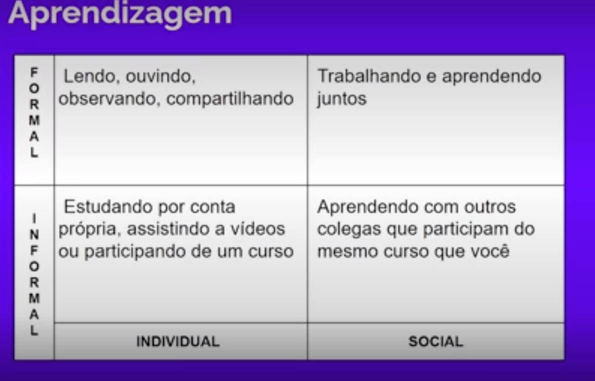

# Metodologia Ágil - Os papéis na metodologia Scrum

---

### Principais papeis da metodologia ágil

1. Scrum Master
2. Product Owner
3. Equipe de desenvolvimento

### Recurso eficazes utilizados para criação de produtos

1. Comportamentos
2. Processos
3. Práticas
4. Ferramentas

### Minimizar riscos em curtos períodos utilizando o princípio da iteração

1. Planejamento
2. Análise de requisitos
3. Projeto
4. Codificação
5. Teste e Documentação

### Fundamental a comunicação entre o grupo em tempo real

1. Programadores
2. Clientes
3. Gerentes
4. Analistas de Negócios
5. Product Owners
6. StakeHolders

### Problemas começam a acontecer

1. Sem orientação e padrões, os membros da equipe descartam metodologias e fazem o
que sentem ser correto fazer.

***O que fazem, de diferente?***

- Reavaliam planos
- Comunicam-se diariamente
- Produzem baixo volume de documentação

### A cultura da organização deve apoiar a metodologia

***Como manter a cultura ágil?***

- Acreditar na metodologia
- Manter poucas, mas competentes pessoas no time

### Scrum Master

- Ajuda a proteger o time das distrações e interrupções comuns no ambiente de desenvolvimento.

- ***Função***

- Potencializar o trabalho da equipe
- Garantir que todos entendam e apliquem os princípios
- Aplicar soft Skills Comunicação, facilitação e política.
- Ser proativo e disposto
- Remover os impedimentos levantados pela equipe durante a execução de cada sprint
- Ser neutro, seu objetivo é desenvolver a independência do Time para que consigam chegar a soluções sozinhos.
- Ser Líder Técnico da equipe, como um gerente de projeto.
- Ser orientador que guia o Product Owner em relação ao time de Desenvolvimento para alinhar o projeto nos moldes da metodologia Scrum.
- Trabalha para promover todas as mudanças organizacionais que sejam necessárias para o bom cumprimento do Scrum.

### Squad

- Squad é um modelo de trabalho e organização de equipes
- Consiste na formação de grupos multidisciplinares que possuem como foco em desenvolver um problema específico
- Todos os membros envolvidos realizam um trabalho colaborativo, fortalecendo a
cocriação de soluções criativas para os projetos
Scrum Master na Squad
- Assim que o Squad de Desenvolvimento identifica um impedimento, o
Scrum máster deve agir para remover esse problema
- Para tratar desses impedimentos, não basta propor soluções temporárias
- É fundamental buscar as causas raízes de problema, que pode ser feito
a partir de ferramentas ágeis.

### Product Owner

Toma as decisões sobre as características e prioridades do produto.

- ***Funções***

- Responsável por criar uma lista de itens pendentes e priorizá-los de acordo com a estratégia geral e os objetivos comerciais
- Mapear as dependências do projeto para determinar a sequência correta do desenvolvimento.

### Scrum Team

- Membros que trabalham na criação do produto.

### Stakeholders

-Todos os envolvidos e interessados nos resultados do produto.

---

# Metodologia Ágil - Scrum

Framework para desenvolvimento de softwares. Possui uma estrutura leve, ***iterativa*** e ***incremental*** para desenvolver, entregar e sustentar produtos complexos.

***Obs Não se aplica somente a software.***

No Scrum existem papeis bem definidas e etapas que devem ser cumpridas em prazos estipulados.

***Obs. Para gerenciar o projeto surge a figura do Scrum Master (Gerente de projeto que coordena a equipe para que as metas sejam alcançadas.)***

***1. Product Owner***

Define metas e missões, garante que todas as ações estejam transparentes para o Time de Desenvolvimento Scrum.

***Obs. Para acompanhar o projeto na visão do cliente surge a figura do Product Owner (PO)***

***PO*** prioriza os itens de ***Backlog do Produto***

***2. Product Backlog***

- Lista ordenada dos requisitos ou funcionalidades que o software deverá ter para ser concluído. (NÃO NECESSÁRIAMENTE SERÁ ENTREGUE TODAS AS FUNCIONALIDADES, MAS É IDEAL.)

- O documento de definição pode ser alterado a qualquer momento.

***3. Sprint Backlog***

- Lista das tarefas a serem executadas durante uma Sprint, para se atingir a meta de Sprint (TEMPO DE ENTREGA)

***4. Sprint Backlog***

- Desmembramento de cada item selecionado do product backlog em pequenas tarefas.

***5. Scrum Team***

- Equipe deve ter ciência da natureza mutável de software, ou seja, as necessidades de os clientes mudar a qualquer momento.

Um processo de desenvolvimento ágil e flexível.

---

# Metodologia Ágil - A simbologia 3-5-3

3 papeis – 5 eventos – 3 artefatos

***3. PÁPEIS***

- Product
- Scrum Master
- Squad de desenvolvimento

***5. EVENTOS***

- Sprint
- Sprint Planning
- Daily Scrum
- Sprint Review
- Retrospective

***3. ARTEFATOS***

- Product Backlog
- Sprint Backlog
- Product Increment

---

# Metologia Ágil - Product Backlog

Hipoteses -> Experiẽncia -> Validação -> Aprendizagem

**Qual é a necessidade do cliente?**

- Dores > Problemas a serem resolvidos

**Como vamos definir as prioridades?**

**Solução** Elimina uma determinada DOR sincronizada com as expectativas do cliente.

### Sprint Backlog

Lista definida durante uma reunião chamada **Sprint Pĺanning Meeting** na qual a equipe decide o que vai ser realizado em determinado **Sprint**

### Feature (recurso)

- Valor comercial objetivo
- Ter dados para estimativa de esforço
- Ser justificavel
- Capaz de caber em um incremento
- Ser testável

Cada parte de uma funcionalidade que oferece valor comercial.

Que atende a uma necessidade das partes interessadas.

---

# Metologia Ágil - Sprint Planning

Reunião de planejamento de um Sprint (São chamadas de cerimônias e são demoradas)
- Deve ser mais simples e objetivas 

---

# Metodologia Ágil - Pilares do Scrum

Transparência > Inspeção > Adaptação

- **Transparência**

Todas as partes interessadas devem ser **transparente** sobre o trabalho que realizam.

Em termos populares "**Deixar às caras**", ou seja comunicar-se com eficiiẽncia e a todo tempo.

- **Inspeção**

Inspecionar **regularmente** todos os artefatos pessoas, fluxos de trabalho, backlogs e incrementos do produto.

Pode ser **conduzida por todos os membros** da equipe.

Estamos melhores do que estavamos ontem ?

- **Adaptação**

A equipe Scrum **deve se adaptar e reagir as mudanças** nas necessidades do cliente e do mercado.

Ocorre a qualquer momento

Os **insights surgem nas dailys** onde os desenvolvedores podem discutir pequuenas melhorias entre si.

---

# Metodologia Ágil - O ciclo de desenvolvimento do Scrum

## Sprint 

- Ciclo de desenvolvimento
- 'Incremento pronto para lançar'
- Evento Container
- Prover propósito e foco ao time
- Possibilita a inspeção (o que ?) (como?)

Contém todos os demais eventos

- Sprint Planning
- Daily
- Sprint Review
- Sprint Retrospective

A duração de uma Sprint tem em média entre 7 e 30 dias

**Sprint significa "corrida."**

Representa o desenvolvimento do **incremento** em um software ou sistema a ser entregue em determinado prazo.

**Obs.** Por que o prazo é tão curto ?

Evitar problemas como

- Mudança de objetivo
- Atraso no feedback do cliente
- Sensação de "Falta de progresso"

**Obs.** Posso alterar o prazo de uma Sprint?

- A resposta é não. Você pode alterar somente entre uma e outra, mas nunca em seu decorrer.

**Obs.** Mas por que se alteraria o prazo?

- Tempo insuficiente para o incremento
- Feriados, Freezing ou Férias
- Condição de mercado
- **Indecisão sobre tecnologia**

---

### O que é Freeze Period?

Período de congelamento onde os desenvolvedores não codificam alterações do sistemas

Geralmente datas próximas a feriados, como natal, ano novo, dia das mães, afins.

**Obs.** Se o time terminar a sprint antes do prazo ?

- Continuar na Sprint
- Buscar bugs, fazer ajustes
- Refatorar o código

**Obs.** Se o time terminar a sprint depois da data?

- Encerrar a Sprint
- Discutir na Sprint Retropesctive
- Entender os motivos
- Melhorar planejamento
  
**Obs.** Se a Sprint se torna obsoleta?

- Decisão do PO

***Causas***

- Mudança de mercado
- Tecnologia ou direção da organização
  
## Incremento

Parte do software ou sistema em estado de **"Pronto"**; potencialmente utilizável, construido durante a Sprint.

---

# Metodologia Ágil - Como funciona uma Daily?

Reunião diária que começa precisamente no horário marcado. 

Obs Não é uma reunião de cobrança!

Garante que todos do time estejam a par de cada progresso feito durante o projeto.

O encontro tem duração determinada (Time-Box) e dura **aproximadamente** de 15 a 20 minutos 

### **Facilitar o entedimento sobre as atividades**

Quem condiz as daily são os desenvolvedores.

Obs Reuniões longas tornam-se cansativas e improdutivas

Os demais participantes são ouvintes.

Acontece no mesmo local e mesma hora todos os dias.

Obs Não é preciso esperar a próxima Daily para reportar um impedimento.

### Mas o que é um impedimento ?

Exemplo

- Permissão para acessar um recurso
- Renovar contrato de serviços

### E quem resolve um impedimento ?

Impedimentos são resolvidos fora da daily com os envolvidos.

As daily são para apresentar pontos ou questionamentos sobre o que tá acontecendo na Sprint.

---

# Metodologia Ágil - Sprint Review

É uma reunião que deseja produzir uma conversa entre a equipe e as partes interessadas sobre como melhorar o produto.

PO aborda objetivos da Sprint e os Itens "Prontos"

PO aproveita as lições aprendida durante a conversa.

Penúltimo evento da Sprint

**Obs Inspeção do incremento e adaptação do Product Backlog**

**Participação**

- Qualquer papel que tenha interesse ou influência
- Participação de partes externas

Time descreve o que aconteceu de positivo na Sprint, bem como os impedimentos e suas soluções.

Time faz uma demonstração do incremento "pronto para lançar"

### Após a Sprint Review terminar

PO apresenta roadmap do produto, visão de metas e possíveis próximas entregas

### E se não há incremento para demonstrar?

Dê transparência aos stakeholders sobre o trabalho desenvolvido.

---

# Metodologia Ágil - Sprint Retrospective

Rever os **erros** e **acertos** no sprint realizado.

Parte super importante do processo, onde é possível aprender com os erros e tentar **aprimorar o produto**

**Obs** Só participam o Scrum Master e o time de desenvolvimento.

**Fases**

1ª fase Time levanta os pontos que influenciaram positivamente.

2ª fase Fatos que não foram bons e que merecem atenção.

3ª fase Trabalhar na construção de um plano de ação.

### Sprint Retrospective

O que você fez realmente bem na última iteração?

Conte algo que te deixa realmente feliz?

Que coisa legal você fez para outra pessoa na última iteração?

### Positivo e Verdadeiro

Sempre analisar na pespectiva de positivo e verdadeiro, tantos os erros como os acertos.

### Aprendizagem

---

# Metodologia Ágil - Backlog Refinement

## Backlog Refinement

### Principais pontos da aula

- O processo de refinamento acontece a todo momento
- Acontece de forma isolada das demais iterações da sprint
- Processo contínuo de responsabilidade do PO
- Importante para um melhor entendimento,dimensionamento e ordenação das ações
- Obtenção de um Backlog mais “limpo”, e melhoria das Sprints Plannings

**Qual é a importância do refinamento?**

- Falta de entendimento
- Falta de dimensionamento
- Falta de ordenação
  
**Beneficios**

- Backlog "limpo"
- Sprint Planning
- Melhoria do entendimento geral

**Resultados**

- Descobertas
- Adição de detalhes
- Divisão de itens
- Evita mal-entendidos
- Evita riscos
- Revisão de prioridade

**Valores**

- Valor Comercial (receita e lucro)
- Valor de Eficiência (dinheiro e tempo)
- Valor de Mercado(novos usuários)
- Valor para o cliente (manter usuários)
- Valor futuro (economia e segurança)

**Epic**

User Story muito grande ou que ainda não foi detalhada e que não pode ser convertida em um incremento

---

# Metodologia Ágil - Kit de Ferramenta

---

# Metodologia Ágil - User Story Points

**Dimensionar Histórias**

Estimular em horas
Estimular no esforço

### Sequência Fibonacci

Progressão númerica onde um número é o resultado dos números anteriores

0,1,1,2,3,5,8,13,21,34,55,89,144

---

# Metodologia Ágil - Planing Onion

Visão dos diferentes niveis de gerenciamento e planejamento do projeto

---

# Metodologia Ágil - Produtividade

### Principais pontos da aula

- Uma mente dispersa pode influenciar muito na sua produtividade, pois torna-se difícil de manter o foco.
- É importante entender a diferença entre colaborar e fazer a tarefa de outra pessoa, para que você não acabe se sobrecarregando.
- A técnica Pomodoro é interessante para manter o equilíbrio entre a produtividade e um tempo de descanso.

1 - mente divagando
2 - Sobrecarga de informação
3 - Interrupções

**Dicas** 

- Faça uma lista de tarefas do dia.
- Comece pelas tarefas mais difíceis.
- Cronometre suas tarefas.
- Faça uma pausa.
- Foco é sempre necessário.
- Faça reuniões rápidas.
- Celebre suas tarefas concluídas.

**Perceba suas emoçoes**

Tudo que está ao seu redor é composto de sua percepção de realidade

**Exemplo:**

Persona, xxx anos, trabalha em uma empresa xxx, familiarizado (ou não) com apps/sistemas, solteiro/casado, mora sozinho (ou não), percebeu a oportunidade no app/sistema xxx para conseguir 

