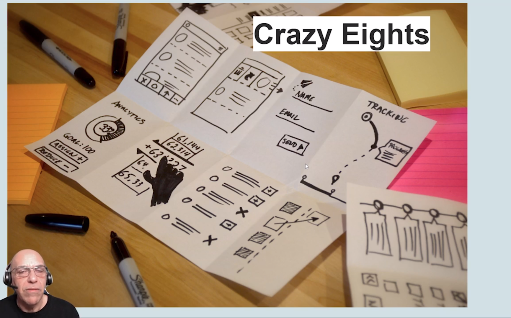

# UX USER EXPERIENCE

---

## Conceitos sobre UX

**O que é UX?**

**Experciência do usuário**, do inglês user experience, é o conjunto de elementos e fatores relativos a interação do usuário com um determinado produto, sistema ou serviço.

Quando aplicado num sistema, gera uma proporção positiva ou negativa.

O termo UX foi utilizado pela primeira vez por Donaid Norman na década de 1990.

**Sempre referente a elementos associados a interação do usuário**

- Resulta numa experiência positiva ou negativa.

**Mas como que sabemos se é algo positivo ou negativo?**

- Realizando diversos testes em prototipos.

### Web

Web 1.0 = Conteúdo

Web 2.0 = Interatividade

Web 3.0 = Semântica

Web 4.0 = Inteligência Artificial

**Qualquer objetivo fisico pode ser um IOT e sempre há uma informação importante que será utilizado**

Donald Norman - 1990
Observar e analisar o design

Maximar:
- Aprendizagem 
- Eficácia
- Relacionamento

Minimizar:
- Dúvida
- Erro
- Abandono
- Insatisfação
- Julgamento
  

## Valores humanos

**Relacionamento - Sabedoria - Integridade**

Interfaces que representam o usuário
Interfaces que ensinam
Interfaces congruentes

---

# Design Process

O processo possui um ciclo composto por algumas etapas:

- User Research – conhecendo e entendendo o usuário
- Analysis – identificando oportunidades
- Design – conceitualização e exploração
- Prototype – implementação da ideia
- User Testing – teste e validação

Todo esse processo acontece para **minimizar AS FALHAS no desenvolvimento**

### Se os usuários encontrarem um Problema, como eles lidam com isso?

### Estimativa de esforço

- Complexidade
- Quantidade de etapas
- Diálogos e Saídas

### Premissas

A Premissa em UX é a proposta das informações necessárias para se chegar a conclusão de um objetivo. Buscando sempre tornar a jornada do usuário, útil, fácil, interessante e principalmente encantadora.

- Obter Feedbacks e melhorar os conceitos de design.
- Criar um produto adequado a necessidades do usuários.
- Design com foco especifico do usuário.
- Testes, hipoteses e simulações direcionados a um design interativo.
  
Motivação * * * * *
Interação * * * * *
Gatilho * * * * *
Habilidade * * * * *

**Definições e analises**

- Definir as restrições básicas.
- Indexação e catalogação.
- Mapeamento de páginas e conexões internas
- Gerenciamento do conteúdo
- Análise de tarefas do sistema
- Análise da navegação e rotulação

**Definição das necessidades do usuário**

- Personas
- Prototipagem (wireframes navegáveis)
- Entregáveis de UX

**Por fim, teste e usabilidades e Documentação.**

---

# Criando personas

**Principais pontos da aula:**

- Tipos de personas segundo Andrzej Marczewsk: Socializadores, Espíritos Livres, Empreendedores, Filantropos, Jogadores, Disruptores
- Mapa de Empatia

### Tipos de Persona

**Socializadores (Relacionamento)**

- Compartilhamento
- Espaço para comentários

**Espiritos Livres (Autonomia)**

- Funcionalidade independente
- Ter opção de escolha

**Empreendedores (Maestria)**

- Buscam estar a par de tudo
- Querem ter a sensação de "conhecimento pleno"[

Mas o que pode ajudar esse tipo de persona a conhecer mais do sistema?

- Seções de ajuda
- Atalhos e ícones

**Filantropos (Propósito)**

- Objetivos que ajudam pessoas
- Relatórios que justifiquem essa atitude

**Jogadores (Recompensas)**

- Etapas ou níveis 
- Títulos, brasões ou Áreas Desbloqueadas  

**Disruptores (Mudanças)**

- Buscam estar em contradição
- Querem ter a sensação de poder apontar melhorias

---

# Conceitos de gamificação

**Principais pontos da aula:**

- Ranking Individuais, reforço positivo de pontuação, likes, medalhas, brasões
- Oferta de versões gratuitas com restrições
- Desbloqueio de funcionalidades que antes estavam visivelmente bloqueadas
- Reconhecimento Social

**Engajamento do usuário** 

- Ranking indivual
- Reforço positivo de pontuação
- Mecanismo de Feedback (Likes e Comentários, Medalhas ou Brasões)

**Recompensas**

- Oferta de versões gratuitas com restrições
- Desbloquear coisas novas
- Ter reconhecimento social
- Ter realização pessoal

**Realização**

- Niveis e metas
- Mapeamento de progressão do usuário
- Posicionamento na jornada de uso do app
  
**Motivação**

- Intrínseca - Criada por valores internos tomando um senso de propósito.
- Extrínseca - Criada por fatores externos como reconhecimento social.

**Aprendizagem**

- Aviso de senhas curtas
- Desabilitar botões de proxima etapa
- Ícones e atalhos
- Jornada do super usuário (curva de uso)

---

# Técnicas de UX

**Principais pontos da aula:**

- Processo do Design Thinking – Empatia, Definição, Ideação, Prototipação, Teste
- Card sorting
- Histórias de usuários
- Crazy Eights

**Card Sorting**

Cartões ou Post-its, físicos ou virtuais, com nomes e palavras que representam os rótulos das categorias em análise. A ideia é organizar, de forma lógica, os cartões criados dinamicamente. 

Dividir a área onde ficam os post-its, em partes lógicas que representam categórias que o usuário pode acessar. Os participantes escrevem seus post-its livremente, sem julgamento.

---

# O que são entregáveis de UX?

**Principais pontos da aula:**

- Objetivos de negócios – missão, visão, valores
- Proposta única de valor
- Análise de competitividade
- Personas
- Análise de conteúdo

1. Objetivos de negócios (missão, visão, valores)
    Proposta Única de Valor.

**Proposta de valor**

Ser um app____(Objetivo)
Que ajuda pessoas a____(promessa)
Por intermedio de ____(como)
Sem que elas tenham que(dor que o app soluciona)

**Exemplo:**

Ser um app de **cupons/vourchers** que **ajuda pessoas a economizar** por intermédio de um **cadastro simples** sem que elas tenham que **perder tempo procurando descontos em lojas**

2. Análise de Competitividade (Pesquise 3 rivais)
Avalie qualidades e fraque

3. Personas (Questionamento Estruturados, Psicologia Humanista)
   Dores e Necessidades

4. Análise de Conteúdo(Card Sorting)
   Debate em Equipe, Mapeamento de soluções

---

# O que são entregáveis de UX (parte 2)?

**Principais pontos da aula:**

- Conceito
- Características de um protótipo
- Benefícios
- Prática de criação de um Wireframe navegável

5. Prototipagem (Wireframes Navegáveis)

**O que é prototipagem?**

Técnica que demonstra ideias e características do funcionamento de um sistema por meio de elementos gráficos, desenhos ou até rabiscos.

**A interface que você vai criar deve ser:**

- Intuitiva
- Simples
- Agradável
- Compreensível ao olhar humano

**Benefícios da prototipagem:**

- Avaliar
- Fazer testes de usabilidade
- Fazer testes de prova de conceito
- Obter validação das partes interessadas
- Complementar a documentação

[Proto.io](https://proto.io/)

---

# Use Case

Os casos de uso são escritos descrevendo como as pessoas realmente usariam seu sistema ao tentar concluir sua jornada.

Como exemplo disso considere alguém utilizando um App para contratar um serviço de reparo hidráulico em sua residência 

**Composição:**

A pessoa que executa o caso de uso **(Ator)**

O que ocorre a cada passo do ator?
**(sistema)**

O ator precisa de algo para cumprir, um objetivo **(ação, tarefa)**

**FLuxos Básicos e Alternativos**

- Fluxo básico é o que deve acontecer.
- Fluxos alternativos são outros eventos que podem acontecer (ou coisas que podem dar errado)

**Caracteristica**

- **Mapear ações** para um objetivo específico
- **Identificar os problemas** associados ao alcance dessa meta
- **Determinar como corrigir** esses problemas e quanto tempo é necessário para fazer isso 
- **Facilitar o caminho** para essa meta para futuros usuários  

# User Jorney

As viagens dos usuários estão ligadas a personas e pessoas reais. Você deverá criar pelo menos uma jornada para cada uma de suas personagens principais no mínimo.

Deve conter uma série de etapas.
Cabe a você decidir quantas você precisa.

Série de etapas (entre 4 a 12) que representam um cenário no qual um usuário pode interagir com o que está projetado.

**Objetivo:**

Demonstrar a maneira como os usuários interagem atualmente com o produto (app/sistema)

Demonstrar como aprimorar a interação do usuários.

**Beneficios:**

Demontrar a visão do projeto, ou seja, comunicar o que o produto visa alcançar.

Entender qual poderia ser um estado futuro do que se está projetando.

Juntamente com as personas, ser uma das principais maneiras de coleta de requisitos no inicio de um projeto 

Ajudam a entender o comportamento do usuário, descobrir como ele vai interagir com o seu sistema. 

---

# 5 planos de Jesse James Garret 

**Principais pontos da aula:**

- Estratégia
- Escopo
- Estrutura
- Protótipo
- Interface
- Produto: funcional e como informação

---

# Entregáveis de UX

**Principais pontos da aula:**

- Objetivos de negócios – missão, visão, valores
- Proposta única de valor
- Análise de competitividade
- Personas
- Análise de conteúdo
- Prototipagem
- Use Case
- User Jorney
- Heurísticas de Nielsen

**Checklist para um entregável UX** 

1. Objetivos de negócios (missão, visão, valores)
      Proposta Unica de Valor

2. Analise de Competitividade (pesquise 3 rivais)
      Avalie qualidade e defeitos 

3. Personas (Questionamento Estruturados, psicologia Humanista)
      "Dores e Necessidades"

4. Análise de Conteúdo (Card Sorting, Debate em equipe, Mapeamento de soluções)

5. Prototipagem (Wireframes Navegáveis)

6. User Case (Caso de Uso)

7. User Journey (Jornada do usuário)

8. Heuristica de Nielsen(Teste de Usabilidade com base nos protótipos)
